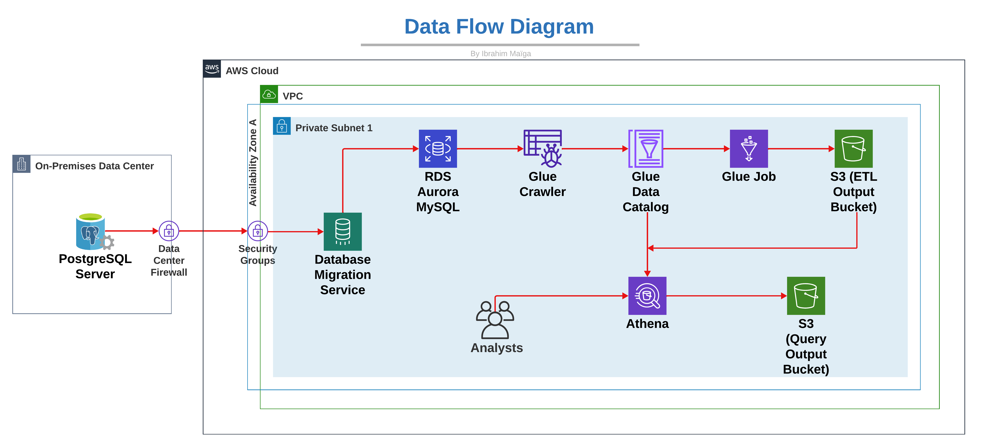

## **Project Overview**

This project aims to build a scalable ETL pipeline designed for Anti-Money Laundering (AML) transaction monitoring. By automating data extraction, transformation, and loading, it supports AML compliance teams with quick access to insights on potentially suspicious activities. 

Ideal for finance and data professionals involved in AML compliance or data engineering, this solution provides a reference for those needing to balance cost efficiency and high security.
The project highlight how practical use of AWS services and data engineering best practices can drive compliance while managing resources effectively.

## **Context and Background**

**Why AML Compliance Matters?**

AML compliance is crucial for financial institutions to detect and report suspicious activity, fulfilling legal obligations.
Banks must perform Know Your Customer (KYC) checks and submit Suspicious Activity Reports (SARs) to identify potential fraud or money laundering.

**Project Scenario:** 
High transaction volumes place stress on databases, making it costly and slow to maintain primary databases for AML monitoring. This pipeline provides a solution by offloading transactions and transforming them into a format optimized for analysis.

## **Project Goals and Objectives**

**Build a Robust ETL Pipeline:** Automate data flow from the primary transactional database to a queryable storage solution.

**Cost-Efficiency:** Minimize project costs through optimized AWS configurations and correct partitioning, maintaining a low cost of operation.

**Data Security and Scalability:** Secure data migration and ensure the solution is scalable to handle increasing data loads without impacting primary operations.

## **Architecture Diagram**

Architecture Diagram

Amazon Aurora MySQL serves as the primary source database, continuously storing real-time transaction data for AML monitoring. AWS Data Migration Service (DMS) facilitates efficient, uninterrupted data replication from Aurora to the analytics environment. AWS Glue performs the ETL processing, transforming raw data into an optimized format, ready for analysis. Transformed data is stored in Amazon S3, a cost-effective and scalable storage solution that enables seamless access to processed data. Finally, Amazon Athena offers fast, SQL-based querying capabilities directly on the data in S3, empowering AML analysts to quickly retrieve insights and identify patterns in transactions.

## **Financial Cost and Lessons Learned**

The project’s cost breakdown revealed that initial setup expenses were elevated due to unoptimized configurations, resulting in higher-than-expected costs early in development. However, through a series of iterative optimizations, I managed to reduce the final project costs significantly to around $10 USD. Key lessons emerged from this process: implementing early partitioning strategies proved essential in lowering read and write costs on S3, and ensuring proper configuration and role permissions helped minimize unexpected charges while enhancing overall security.

## **Prerequisites**

The required setup for this project included a PostgreSQL database configured locally as a staging ground to hold raw transaction data before migration. On AWS, several services were configured to streamline data handling, including Amazon Aurora for scalable storage, S3 for secure storage of transformed data, Glue for ETL processes, Athena for querying, and AWS DMS for data migration. A key compatibility consideration was ensuring that AWS DMS supported PostgreSQL version 15, crucial for maintaining smooth data replication throughout the pipeline.

## **Step-by-Step Guide Overview**

**Step 1: Local PostgreSQL Database**

The process begins by importing raw data into a locally set up PostgreSQL database, which acts as the initial source for data migration. 

**Step 2: Amazon Aurora MySQL**

Next, a highly available and secure Amazon Aurora MySQL instance is configured to migrate the data. Aurora’s robust infrastructure ensures reliability and scalability, allowing the data to be readily available for ETL job processing.

**Step 3: VPC Endpoint & Security Groups**

To maintain secure access and data flow, a VPC endpoint and security groups are set up. This configuration allows controlled communication between AWS DMS, S3, and other AWS resources, ensuring that data remains secure while traversing different stages of the pipeline.

**Step 4: AWS DMS Setup**

AWS Database Migration Service (DMS) is configured by defining both source and target endpoints, streamlining data replication from the PostgreSQL database to Amazon Aurora MySQL. This setup minimizes downtime and ensures continuous data flow, making data from the local source seamlessly available within the AWS environment.

**Step 5: S3 Buckets & IAM Roles**

Data storage on Amazon S3 is established for the ETL output, providing scalable and cost-effective storage. IAM roles are assigned following the least privilege principle to enhance security, ensuring that each service has only the permissions necessary for its function, thus reducing potential vulnerabilities.

**Step 6: AWS Glue for ETL**

AWS Glue is set up to handle extraction, transformation, and loading, removing personally identifiable information (PII), and converting data into Parquet format. This transformation not only reduces data size but also improves query performance, making large datasets easier to manage and more efficient to analyze.

**Step 7: Athena Querying**

Finally, Amazon Athena is configured to query the transformed data directly from S3, providing AML analysts with fast, direct access to insights. This setup enables quick querying capabilities, allowing analysts to perform data analysis without the need for extensive ETL processing in real-time, enhancing both speed and usability.

## **AWS Glue & Athena Integration**

AWS Glue functions as the primary ETL engine, cataloging metadata and orchestrating jobs to transform raw data into partitioned Parquet files optimized for efficient querying. Leveraging this metadata catalog, Amazon Athena enables AML analysts to perform quick, SQL-based analyses directly on the Parquet files stored in S3. This streamlined setup empowers analysts to swiftly identify irregularities in transaction data, providing an effective tool for uncovering potential compliance issues.

## **Example Queries for AML Monitoring**

The transaction flagging query identifies high-risk transactions that may indicate laundering patterns, enhancing detection of potentially suspicious activities. A high-value transactions query filters for transfers over $10,000, meeting compliance requirements for large transactions, while a high-risk location filter zeroes in on transactions originating from regions or jurisdictions flagged for laundering risks, supporting targeted analysis. Each query aligns with typical AML patterns, offering focused insights that aid compliance teams in monitoring and managing transaction data effectively.

## **Challenges and Solutions**

Balancing security with cost presented a challenge, as configuring robust security (such as VPCs and IAM roles) while keeping AWS costs manageable required careful planning. Ensuring data compatibility during schema transformation also posed difficulties, particularly in migrating data formats from PostgreSQL to Athena. Solutions included implementing minimal-permission IAM roles, securing VPC configurations, and closely monitoring access controls to fortify security without inflating costs. Schema validation and mapping were critical in maintaining data consistency across services; using AWS Glue’s schema transformation capabilities enabled alignment, reducing the risk of data misalignment during migration and transformation.

## **Key Takeaways**

This project demonstrates real-world experience with Anti-Money Laundering (AML) compliance processes in a financial setting, showcasing effective use of AWS services to meet strict regulatory needs while controlling costs. By leveraging AWS tools in an integrated approach, the setup provides a scalable solution for financial institutions needing robust transaction monitoring capabilities. Potential applications include deployment as a scalable monitoring framework for banks or regulatory bodies, aiding AML analysts in identifying suspicious patterns efficiently. The project also serves as a valuable reference for teams managing sensitive transaction data within secure cloud environments, setting a foundation for compliance and operational best practices.

## **Thank You!**

Thank you for reading! I hope this overview provides clear insights into how cloud-based ETL solutions can effectively address AML requirements while optimizing for efficiency.

