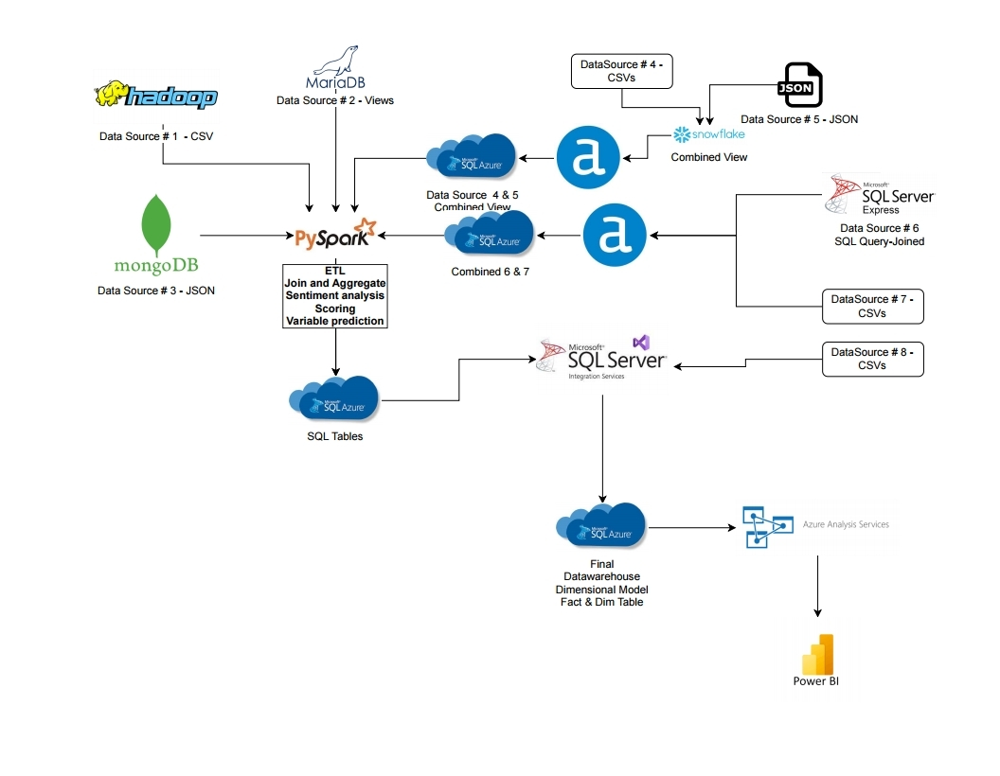

## **Contents**

  **1. Introduction**

  **2. Data**

    **2.1 Data Sources**

    **2.2 Databases**

  **3. ETL Pipeline**

    **3.1 DATA CLEANING**

    **3.2 Data Consolidation**

  **4. Database Migration**

  **5. Dashboarding with Power BI**

  **6. Results and Findings**

  **7. Limitations and Challenges**

  **8. Conclusion**

  **9. References**

## **Abstract**

This report explores the impact of global warming on crime rates, birth rates, and energy consumption in the United States and Canada. With the evolution towards a digitally connected world, the volume, variety, and velocity of data have increased significantly. To derive valuable insights from this data, we utilized temperature, crime, natality, and energy consumption data from various sources. By employing big data tools and techniques, we transformed raw data into meaningful insights. Key findings indicate that higher temperatures are correlated with increased crime rates and energy consumption, while extreme temperatures are associated with reduced birth rates. This project demonstrates the potential of big data in enhancing our understanding of the implications of global warming.

This project aims to integrate and analyze diverse data sources to gain insights into the correlations between weather patterns, birth rates, crime statistics, and energy consumption in Canada and the USA. By leveraging big data technologies such as Hadoop, PostgreSQL, MongoDB, MySQL, and MSSQL Server, we aim to build a comprehensive ETL pipeline that facilitates the seamless collection, storage, and analysis of large datasets. The outcome will provide valuable insights to inform policy decisions and operational strategies across various sectors.

## **1. Introduction**

The digital age has led to an exponential increase in data generation, characterized by high volume, variety, and velocity. Managing this much data requires robust data governance policies and best practices. However, the true value of data lies in its ability to provide actionable insights. This project aims to analyze the impact of global warming on crime rates, birth rates, and energy consumption in the US and Canada using temperature, crime, natality, and energy consumption data.

The goal of this project is to leverage big data technologies to process and analyze data from multiple sources, thereby gaining a better understanding of how rising global temperatures affect various societal metrics. By integrating and analyzing data from different databases, we aim to uncover patterns and correlations that can inform policy decisions and future research. The goal is to create a seamless data flow from collection to analysis, enabling comprehensive insights into how these variables interact over time and across regions.

## **2. Data**

### **2.1 Data Sources**

This project extracts data from various publicly available sources to collect the data required for our analysis, including:
* APIs from weather services, crime statistics bureaus, and energy consumption reports.
* Publicly available datasets from Government websites and international organisations. 
* Synthetic data.

In order to conduct our analysis, it is crucial to ensure that the datasets we collect are on a daily basis. This is imperative for our process. The datasets that were sourced in this project are listed below.
 
**1. [USA Daily Birth](https://github.com/fivethirtyeight/data/blob/master/births/US_births_2000-2014_SSA.csv)**	

**2. [USA Natality](https://wonder.cdc.gov/controller/datarequest/D10;jsessionid=4E3CD4A6945320675A2E65F0A87B)**

**3. [Canada Daily Birth](https://www.statcan.gc.ca/en/start)**

**4. [USA Daily Temperature](https://www.ncei.noaa.gov/pub/data/uscrn/products/daily01/)**

**5. [Canada Daily Temperature](https://dd.weather.gc.ca/climate/ltce/daily/temperature/)**

**6. [USA Daily Energy Consumption](https://www.eia.gov/electricity/gridmonitor/dashboard/electric_overview/US48/US48)**

**7. Additional sources:**
* **[USA Accidents](https://www.kaggle.com/datasets/sobhanmoosavi/us-accidents/data?select=US_Accidents_March23.csv)**
* **[Canadian Car Accidents](https://www.kaggle.com/datasets/tbsteal/canadian-car-accidents-19942014)**	
* **[USA Hourly Energy Consumption](https://www.kaggle.com/datasets/robikscube/hourly-energy-consumption)**

### **2.2 Databases**

**Data Collection and Preprocessing**

Data was gathered from nine different sources, pre-processed, and stored in seven databases as follows:
* **Apache Hadoop:** US crime data (us_crime.csv) 
* **Snowflake:** Canadian temperature data (ca_temp.csv)
* **PostgreSQL:** US temperature data (us_temp.csv)
* **MySQL:** US birth data (us_birth.csv)
* **SQL Server:** US energy consumption data (us_energy.csv)
* **MongoDB:** Canadian birth data (ca_birth.json)
* **Local Machine Storage:** Canadian crime data (ca_crime.csv)

Initial data collection and preprocessing involved cleaning and standardizing the datasets. This included handling missing values, normalizing temperature readings, and ensuring consistency in the data formats across different sources.

For Canadian birth data, I could only get monthly counts, and I generated the daily counts using the actual monthly totals to ensure accuracy.

DBeaver UI on Azure VM

## **PROGRAMMING LANGUAGES**
* Python
* SQL
* PySpark
* Shell Scripting

## **3. ETL Pipeline**

DATA FLOW DIAGRAM

Our ETL process commences with extracting raw data from the data sources, which is then organised into several datasets. Each dataset undergoes a cleaning and pre-processing phase before being stored in its respective databases, such as Apache Hadoop, Microsoft SQL Server, PostgreSQL, and MongoDB. Additionally, one dataset is retained as a CSV file to replicate local data processing scenarios.

Apache Spark is utilised to consolidate data from different databases. The consolidated data is then exported to a CSV file and imported into Azure SQL Server using SSMS. Azure SQL Server, a cloud-based service, facilitates access to its data for all team members, regardless of location.

At the final stage, Power BI visualizes the data and provides insights for our research.

### 3.1 DATA CLEANING

**1. Data Alignment:**

Aligned datasets to a common timeline to ensure consistency in time series analysis. This involved transforming various temporal resolutions (daily, monthly, yearly) into a unified format.

**2. Data Normalization:**
- Standardized units of measurement across different datasets (e.g., Fahrenheit to Celsius for temperature data
- Harmonized categorical variables, especially in crime datasets, to ensure comparability between US and Canada data.

**3. Handling Missing Data:**
- Identified and addressed missing values through interpolation or imputation methods.
- Ensured that the missing data did not skew the results by applying appropriate statistical techniques.

**4. Data Filtering:**

Filtered out irrelevant data points and outliers that could affect the analysis. For instance, extreme temperature values that were likely recording errors were excluded.

**5. Data Integration:**
- Merged datasets from different sources, ensuring data integrity and consistency.
- Used ETL (Extract, Transform, Load) processes to consolidate data into a unified database, facilitating easier access and analysis.

**6. Data Validation:**
- Validated the accuracy of the data by cross-referencing with reliable sources.
- Ensured that the datasets were free from duplicates and errors.

### **3.2 DATA CONSOLIDATION**

To facilitate comprehensive analysis, we configured an Azure VM with 4 CPUs and 8GB RAM to host a single-node Hadoop cluster, PySpark, and DBeaver. However, due to resource constraints, this VM was inadequate, leading to its replacement with a more powerful VM with 8 CPUs and 32GB RAM.

Using PySpark, we aggregated data from the six databases, performed additional cleaning, and joined the datasets to create a unified dataset. The combined dataset was then exported to Azure SQL Server and subsequently imported into PowerBI for analysis and reporting.

To effectively manage and analyze the large and varied datasets, we utilized PySpark for aggregation and querying. PySpark is the Python API for Apache Spark, which is a powerful open-source distributed computing system.

**Benefits of Using PySpark:**
* Scalability: PySpark’s distributed computing capabilities allowed me to scale the data processing tasks across multiple nodes, handling large volumes of data efficiently.
* Speed: Spark’s in-memory processing and optimized execution plans significantly reduced the time required for data aggregation and querying compared to traditional methods.
* Integration: PySpark seamlessly integrates with various data sources, including HDFS, Apache Hive, and relational databases like MySQL and PostgreSQL, enabling easy data consolidation from diverse sources.
* Flexibility: PySpark supports both SQL queries and complex data transformations using its DataFrame API, providing the flexibility needed for our data consolidation tasks.

**1. Data Loading**

I loaded the cleaned datasets into Spark DataFrames from various storage systems, including Snowflake and Hadoop Distributed File System (HDFS).

**2. Data Transformation**

Using PySpark’s DataFrame API, I performed necessary transformations such as filtering, joining, and grouping data. These transformations helped in aligning the data from different sources and preparing it for analysis.

**3. Aggregation**

PySpark’s powerful aggregation functions enabled me to compute summary statistics, such as average daily birth rates and total daily energy consumption, across large datasets efficiently.

**4. Querying**

For querying the data, I used PySpark SQL, which allowed me to run SQL-like queries on the dataframes. This approach provided an intuitive and familiar interface for data analysts to extract insights from the consolidated data.

**5. Data Export**

After performing the necessary aggregations and queries, the resulting datasets were exported to formats suitable for further analysis and visualization, such as CSV files and tables in a relational database. In our case we are using PowerBi for further visualization

## **4. Data Migration**

Data migration involves transferring data from source systems to the target data warehouse. This process ensures that data is accurately and efficiently moved while maintaining its integrity. ETL scripting techniques and database connector tools facilitated smooth migration and data replication.

## **5. Dashboarding with Power BI**

**PowerBI** was used to create various visualizations to represent the findings:

**Heat maps** depicting the correlation between temperature and crime rates.

**Line graphs** showing trends in birth rates relative to temperature variations.

**Bar charts** illustrating energy consumption patterns in relation to temperature changes.

Figure 1. The average temperature in the US vs Canada, in Celsius

Figure 2. Locations and quantities of data collected

Figure 3. Dashboard of US Statistics, including birth rate, energy demand, and crime rate

Figure 4. Dashboard of Canada’s Statistics, including birth rate, max and min temperatures, and crime rate

## **6. Results and Findings**

**Temperature Trends:**

Average temperatures in the US are higher than in Canada.
There is a noticeable increase in temperatures over the years, indicative of global warming trends.

**Crime Rates:**

Higher temperatures are positively correlated with increased crime rates in both the US and Canada.
This correlation suggests that as temperatures rise, the likelihood of criminal activity also increases.

**Birth Rates:**

Extremely high temperatures are associated with reduced birth rates in both countries.
This trend may be attributed to the adverse effects of heat on human health and fertility.

**Energy Consumption:**

Energy consumption is directly correlated with temperature variations.
Higher temperatures lead to increased energy demand, particularly for cooling purposes, while lower temperatures increase heating needs.

## **7. Limitations and Challenges**

**1) Procuring datasets that matched for all the metrics we are querying**
* Datasets with dissimilar scopes of time, frequency of data collection, and even unit measurements were a significant challenge that necessitated the use of big data analytical tools to aggregate this data across multiple sources and adjust it to be comparable.
* Ensuring that the crime data included a similar scope of criminality – certain crimes in Canada aren’t even considered crimes in the US.
* Ensuring data relevant to my use case met the standards for big data in terms of size and format (CSV vs JSON).

**2) Issues with resources and resource allocation**
* Handling large datasets requires substantial computational power and memory. My initial Azure Virtual Machine setup did not provide sufficient power to efficiently process and analyze the data, which led to multiple crashes of Spark sessions.
* I encountered an issue with the Hadoop NameNode entering safe mode, which halted all read and write operations on the file system. Safe mode is generally enabled when the NameNode detects resource constraints or during startup until a minimum percentage of data blocks are replicated safely. This can disrupt workflows, especially in resource-intensive tasks.
* Procuring high-quality datasets, especially from paid sources, and upgrading computational resources were constrained by budget limits.

**3) Difficulties connecting different databases and aggregating data**
* Integrating data from heterogeneous sources (Hadoop HDFS, Snowflake, SQL Server, MongoDB, PostgreSQL, and MySQL) involved significant compatibility issues. Each database has its own query language and data handling mechanisms.
* Aggregating data from different sources required complex ETL processes. Ensuring data integrity and consistency across databases was a major hurdle.
* Querying large datasets across different databases resulted in high latency and performance issues, slowing down the analysis.
* Each database have a different schema for storing similar data, necessitating a thorough understanding and mapping of these schemas for accurate data integration.

## 8. **Conclusion**

This project demonstrates the potential of big data in transforming raw data into valuable insights. By analyzing the impact of global warming on crime rates, birth rates, and energy consumption, I have uncovered significant correlations that can inform policy and decision-making. The findings highlight the importance of addressing climate change and its far-reaching effects on society.

Future work could involve extending the analysis to include additional metrics and regions, as well as exploring predictive modeling techniques to forecast the impacts of global warming. Continued advancements in big data technologies and methodologies will further enhance our ability to derive meaningful insights from complex datasets.

This project underscores the value of big data in understanding and addressing global challenges, reinforcing the need for robust data governance and analytics frameworks.

## **9. References**

1. [Government of Canada. (n.d.). Daily climate data. Retrieved July 11, 2024](https://climate-change.canada.ca/climate-data/#/daily-climate-data)
2. [Government of Canada. (n.d.). Daily temperature data. Retrieved July 11, 2024](https://dd.weather.gc.ca/climate/ltce/daily/temperature/)
3. [National Centers for Environmental Information. (n.d.). Climate Reference Network (CRN). Retrieved July 11, 2024](https://www.ncei.noaa.gov/access/crn/)
4. [National Centers for Environmental Information. (n.d.). U.S. Climate Reference Network (USCRN) daily data. Retrieved July 11, 2024](https://www.ncei.noaa.gov/pub/data/uscrn/products/daily01/)
5. [VanderPlas, J. (n.d.). CDC births data. GitHub. Retrieved July 11, 2024](https://github.com/jakevdp/data-CDCbirths/blob/master/births.csv)
6. [FiveThirtyEight. (n.d.). US births 2000-2014 data. GitHub. Retrieved July 11, 2024](https://github.com/fivethirtyeight/data/blob/master/births/US_births_2000-2014_SSA.csv)
7. [Centers for Disease Control and Prevention. (n.d.). CDC WONDER data request. Retrieved July 11, 2024](https://wonder.cdc.gov/controller/datarequest/D10;jsessionid=4E3CD4A6945320675A2E65F0A87B)
8. [Kaggle. (n.d.). US accidents data. Retrieved July 11, 2024](https://www.kaggle.com/datasets/sobhanmoosavi/us-accidents/data?select=US_Accidents_March23.csv)
9. [Kaggle. (n.d.). Canadian car accidents (1994-2014) [Data set]. Retrieved July 11, 2024](https://www.kaggle.com/datasets/tbsteal/canadian-car-accidents-19)