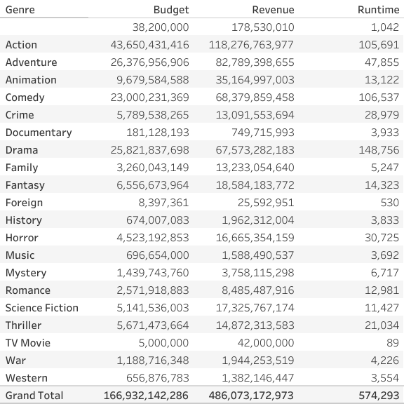
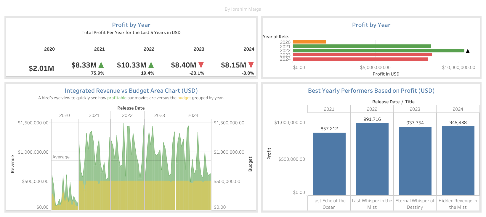
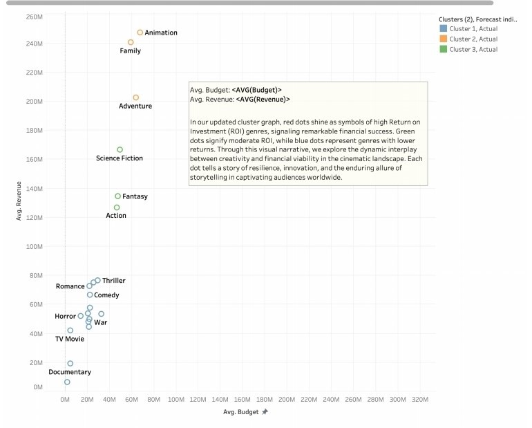
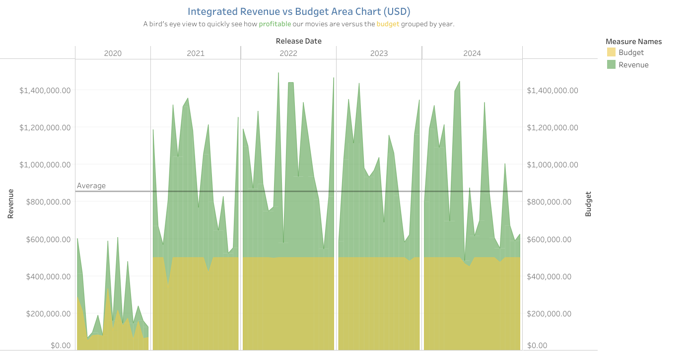
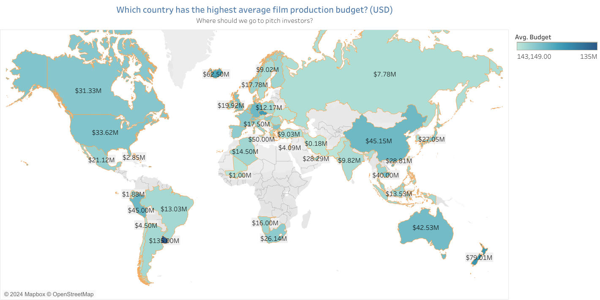
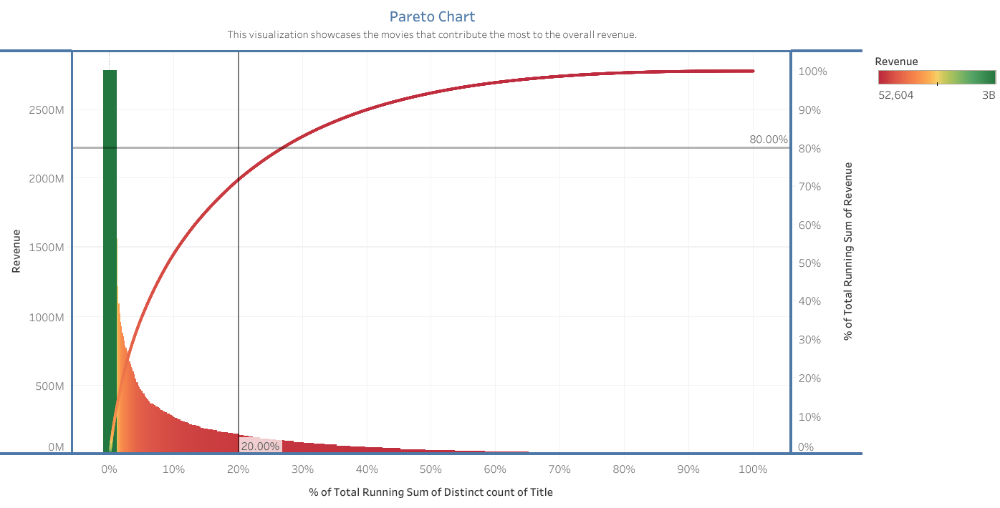

## A. Definition, Objectives, and Scope

**Company Overview**

Bon Films Inc. is a mid-budget film production company, operating within a financial range of 100,000 to 1,000,000 USD. The company also runs an in-house streaming service that focuses on English and French-language films for the Canadian market. Unlike traditional film production companies that rely heavily on creative intuition, Bon Films employs a data-driven approach integrated into its production and distribution model. This method supports informed creative decisions, ensures efficient turnaround times, and maintains a balance between financial goals and artistic integrity.

The main objective is to use data insights to improve decision-making processes, especially in determining the optimal runtimes for movies and identifying the directors best suited for specific genres. This strategy aims to enhance the financial viability of projects while preserving the creative aspects of filmmaking.

**Industry Context**

The global entertainment and media industry is estimated to have a total revenue of $2.8 trillion USD in 2023, and is expected to grow at a compound annual growth rate of 3.9% over the next five years, as reported by [PricewaterhouseCoopers](https://www.pwc.com/gx/en/issues/business-model-reinvention/outlook/insights-and-perspectives.html). With the advent of streaming platforms, audience retention and engagement have become crucial metrics. Data-driven strategies are increasingly employed to mitigate risks and align productions with prevailing successful trends. Nonetheless, excessive reliance on data has often led to a saturation of repetitive content, potentially stifling creativity. By focusing on runtime and genre-specific data, Bon Films aims to produce content that balances creative uniqueness with commercial viability, emphasizing collaborations with emerging directors aligned with the company’s strategic goals.

**Functional Areas of Focus**

The analysis conducted in this context spans multiple functional areas, including finance, sales, and marketing. Financial investment strategies, marketing efforts, and production timelines are optimized through data analysis to align with audience preferences and industry standards. Understanding the correlation between movie runtime and genre is vital for producing content that meets both consumer expectations and financial objectives.

**Objectives**

The main objective is to develop a production strategy rooted in data-driven insights. This involves analyzing competitor data with a focus on key elements such as budget, revenue, runtime, cast, language, genre, and audience ratings. Such an analysis will inform strategic decisions for upcoming projects to maximize their potential for success, both at the box office and on the company’s streaming platform. Additionally, segmenting the analysis by genre ensures that movie formats align with audience expectations and minimize risks such as viewer drop-off due to excessive runtimes.

Another key objective is to identify emerging directors whose work aligns with Bon Films’ strategic vision and creative direction.

Text Table

**Scope of Analysis**

The scope of this analysis is confined to films that align with Bon Films’ budget range and have verifiable revenue data. Films with missing or incomplete revenue documentation will be excluded to ensure the results are relevant and applicable to the company’s operations and financial strategy.

## B. Data Acquisition

The data for this analysis is sourced from [The Movies Dataset](https://www.kaggle.com/datasets/rounakbanik/the-movies-dataset) on Kaggle, which consolidates information from [TMDb](https://www.themoviedb.org/) and [IMDb](https://www.imdb.com/). These are well-established databases in the film industry, maintained and updated regularly by industry professionals. The dataset includes a unified identifier linking primary keys from both TMDb and IMDb, facilitating consistent data analysis. Preprocessing and data cleaning, such as JSON parsing for genre extraction, are conducted using Tableau Prep to ensure the dataset is ready for visualization and analysis.

## C. Data Visualization

Data visualization is performed using Tableau, which enables the creation of comprehensive visual summaries. These include detailed text tables and interactive dashboards that highlight key trends and correlations in the data.

Dashboard

1. **Data Discoveries**

The challenge faced by Bon Films is selecting movie genres and optimal release schedules that maximize revenue. This requires a historical analysis of revenue trends, genre-specific profitability, seasonal performance, and return on investment (ROI).

**Key Observations**

Bon Films Inc. leverages data analysis and visualization to enhance its production processes. By using historical data and viewer preferences, Bon Films strategically optimizes projects to maximize revenue. Tools like Tableau Prep and Tableau are used to transform raw data into actionable insights, demonstrating technical expertise and facilitating complex data storytelling. This positions Bon Films as a proactive industry player employing innovative, data-driven strategies.

**Release Timing**: The analysis indicates that movie releases in June and December tend to yield higher revenue. This trend points to the potential benefits of strategically timing film releases to coincide with peak moviegoing periods, such as summer holidays and the festive season.

**Genre Profitability**: Action, Adventure, and Drama genres have demonstrated significant profitability. These genres have consistently attracted large audiences and generated substantial revenues, making them suitable for investment.

**Viewer Preferences**: Drama as a genre receives a high volume of viewer votes, indicating that audiences value it both critically and commercially. This suggests that producing quality Drama films could satisfy audience demand while maintaining profitability.

**ROI Analysis**: A positive correlation is evident between budget size and revenue, which is valuable for informing budget allocation decisions. Higher-budget productions tend to yield higher revenues, although this relationship must be balanced against potential financial risk.

**Genre-Specific Revenue Insights**: The following chart visualizes average budget and revenue by genre, highlighting that Animation, Adventure, and Family films command higher budgets and revenues, underscoring their profitability. However, these high-revenue genres risk saturation as they attract heavy investment, leading to increased competition and potentially diminishing returns. Conversely, genres like Romance, Comedy, and Horror, while yielding lower average revenues, present valuable growth opportunities with less competition, allowing Bon Films to diversify its portfolio strategically. This data-driven approach informs investment in promising genres while balancing potential risks in saturated markets.

Cluster Analysis

**Trends and Patterns**

Seasonal trends reveal that timing releases to align with peak viewing periods, like June and December, can greatly enhance box office performance. The Action and Adventure genres, in particular, demonstrate consistently high ROI, indicating their resilience to market fluctuations. Key insights from this analysis highlight optimal release periods, high-profit genres, and the positive relationship between budget and revenue. Recommendations include exploring genre crossovers, catering to audience preferences, and employing strategic budgeting to maximize returns.

2. **Root Cause Analysis**

The strategic goal of Bon Films is to use data to guide production decisions and mitigate risk without stifling creativity. Initial analyses reveal that uneven data distribution across genres, due to movies being tagged with multiple categories, can complicate genre-specific insights. To refine target genres, it is crucial to address this distribution issue.

Historical data also reveals that poorly reviewed movies often perform poorly at the box office. Thus, public reception and critical acclaim play a key role in determining commercial success. The hypothesis that shorter runtimes are more suitable for certain genres, such as Animation targeting younger audiences, finds support in the analysis. This allows for strategic adjustments to runtime, depending on the target demographic and genre.

**Findings**:

The historical revenue and budget trends chart for Bon Films indicates significant fluctuations over the years. Sharp peaks and valleys illustrate revenue volatility, with an average line providing a baseline for typical revenue and budget. The downward profit trend in 2023 warrants a focused investigation into genre choices and thematic content.

Budget vs Revenue

**Runtime Considerations**: High-performing Animation films often have longer runtimes and deviate from strictly family-oriented themes.

**Action and Adventure**: These genres benefit from extended runtimes, which allow for deeper story development and higher engagement.

**Recommendation**: For initial projects, producing an Animated Action-Adventure film approximately two hours in length and releasing it in December could align with observed revenue trends and audience expectations.

3. **Insights and Recommendations**

**Scorecard Analysis**:

Profit analysis from 2020 to 2022 shows a steady growth trajectory, indicating initial success in adopting data-driven production strategies. However, a profit decline of 23.1% in 2023 suggests the need for further investigation into specific areas such as genre choices, thematic content, and marketing strategies.

**Budget and Revenue Observations**:

The world map of film production budgets highlights the highest average film budgets in countries like Germany, China, and Australia. This insight helps Bon Films consider international market trends for potential expansion and strategic partnerships. While the U.S. and Canada have smaller average budgets, they offer unique production opportunities at competitive prices.

World Map

**Strategic Recommendations**:

**Investigate Profit Declines**: A thorough analysis of the 2023 decline should be conducted, focusing on genre distribution, thematic trends, and marketing effectiveness to identify actionable areas for improvement.

**Budget Optimization**: Refining budget allocation strategies to enhance efficiency without reducing production quality is essential for sustainable growth.

**Adopt Proven Successful Elements**: Studying high-performing films in the market for replicable success factors can offer valuable insights.

**Innovative Content and New Directors**: Introducing innovative themes and collaborating with emerging directors can infuse fresh perspectives and attract new audiences. Leveraging new technologies within Animation and other underutilized genres could further enhance Bon Films’ competitive position.

Utilizing a Pareto analysis of genre profitability can guide refined strategic decisions. By identifying top-performing genres responsible for the majority of revenue, resources can be optimally allocated to focus on these high-impact areas.

Pareto chart

## D. Conclusion

Combining detailed data analysis with strategic cost management and creative innovation provides a clear pathway for Bon Films to achieve sustained growth and profitability. Aligning production strategies with data-driven insights ensures films resonate with audiences while meeting financial goals.

