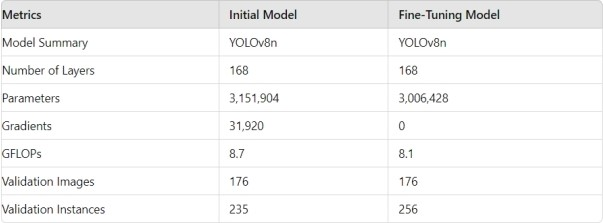
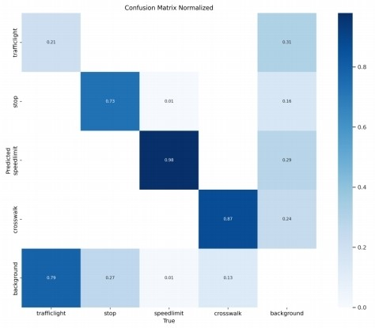
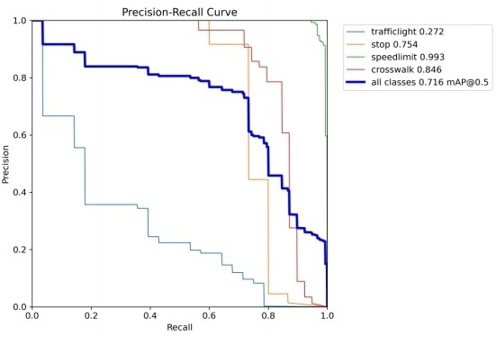
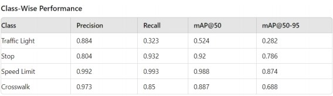
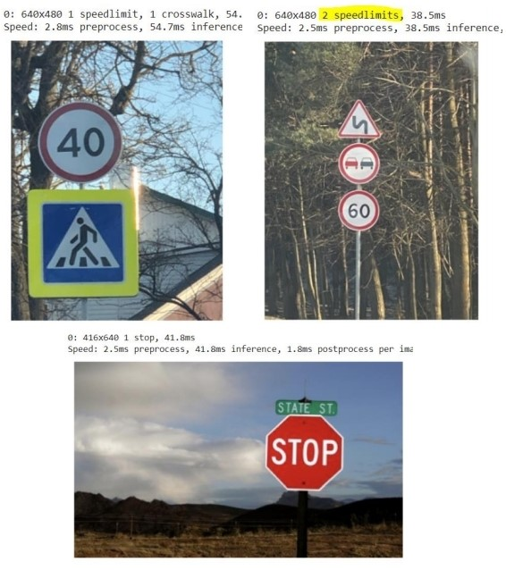
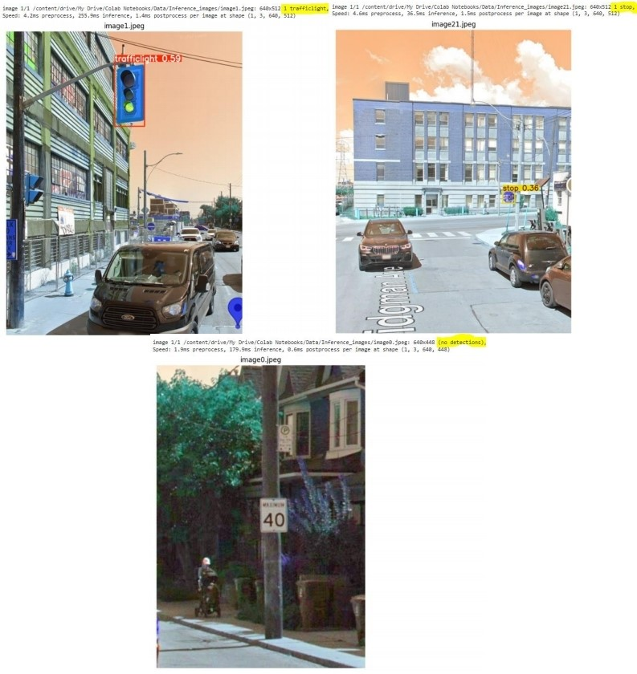

## Table of Contents*

1. Introduction
2. Story
3. Problem
4. Dataset
5. Model Selection
6. Model Training
7. Training Metrics
8. Outcome Analysis
9. Demonstration
10. Validation Images
11. Conclusion
12. Further Development
13. Q&A
14. References

## 1. Introduction

In this project, I explore the complexities of Traffic Sign Recognition (TSR), a pivotal technology for autonomous driving and smart city systems. Leveraging the power of the YOLOv8 model, I set out to create a robust, high-accuracy solution for detecting and classifying key road signs, such as stop signs, traffic lights, crosswalks, and speed limits. Through extensive training, data augmentation, and model fine-tuning, this TSR system achieves real-time detection with impressive precision and recall, making it well-suited for practical deployment in real-world, on-road environments.

## 2. The Story

This project is inspired by real-world driving challenges where traffic sign visibility is often compromised by environmental factors, leading to potentially hazardous situations. Driven by a vision for safer roads, I set out to build a deep-learning-powered system capable of accurately recognizing traffic signs even under difficult conditions. My goal is to create a solution that enhances driver awareness, supports safer decision-making, and ultimately reduces traffic sign-related incidents.

## 3. Problem Statement

Traffic Sign Recognition (TSR) involves both object detection and classification, made challenging by factors like changing weather conditions, occlusions, and variable lighting. Achieving accurate TSR requires the ability to distinguish subtle differences between similar signs while maintaining high speed and low latency; critical features for real-world use in autonomous vehicles and advanced driver-assistance systems.

## 4. The Dataset

The dataset, sourced from Kaggle, contains 877 images annotated in PASCAL VOC XML format across four classes: Traffic Light, Stop, Speed Limit, and Crosswalk. To make the dataset compatible with YOLOv8, I utilized a custom Python function to convert these XML annotations into the YOLO format, allowing for seamless integration with YOLOv8 for training.

Key preprocessing steps included:

**Annotation Conversion:** Converted XML annotations to the YOLO format to align with YOLOv8's requirements.

**Image Resizing and Normalization:** Applied uniform resizing and normalization to maintain consistency in input dimensions and color scales.

**Data Splitting:** Divided the dataset into training, validation, and test sets to support model training, performance tuning, and evaluation.

This preprocessing pipeline ensured a well-structured and standardized dataset for accurate and efficient training.

## 5. Model Selection

I selected YOLOv8, specifically the nano version (YOLOv8n), for its exceptional speed and accuracy, making it highly suitable for real-time applications. Building on the efficiency of the YOLO series, YOLOv8 enables simultaneous object detection and classification with high precision and minimal latency; key features for real-world performance.

**Alternative Models Considered**

I explored other models, including Faster R-CNN and SSD, but they fell short on the speed and efficiency required for real-time detection. A detailed comparison of these models confirmed that YOLOv8 strikes the ideal balance between accuracy and processing time, making it the optimal choice for this project.

## 6. Model Training

Training Metrics

The model training phase focused on configuring YOLOv8 for optimal performance and applying targeted data augmentation techniques to improve robustness and generalization.

### Training Configuration
- **Model:** YOLOv8n
- **Epochs:** 50
- **Batch Size:** 16
- **Image Size:** 640
- **Optimizer:** AdamW

### Data Augmentation Techniques

To enhance the model’s generalization and adaptability, several augmentations were applied:
- **Blur:** Reduces high-frequency noise for better generalization.
- **MedianBlur:** Addresses outliers and improves performance under various lighting.
- **ToGray:** Prepares the model for grayscale conditions.
- **CLAHE:** Enhances contrast in low-visibility scenarios.

### Training Process and Fine-Tuning

During initial training, the model faced accuracy issues. Fine-tuning resolved these and substantially enhanced performance, as demonstrated below:

- **Metrics Before Fine-Tuning**
  - Precision (P): 0.0
  - Recall (R): 0.0
  - mAP@50: 0.0
  - mAP@50-95: 0.0

- **Metrics After Fine-Tuning**
  - Precision (P): 0.913
  - Recall (R): 0.775
  - mAP@50: 0.83
  - mAP@50-95: 0.658

These results illustrate the impact of meticulous fine-tuning, which optimized the model’s ability to manage diverse, real-world conditions with improved accuracy and reliability.

## 7. Training Metrics

Confusion Matrix Normalized

Precision-Recall Curve

Throughout training, I tracked key metrics to assess the model’s performance and improvements over time:

- **Precision and Recall:** These metrics revealed the model’s accuracy in correctly identifying traffic signs while minimizing false positives.
- **mAP@50 and mAP@50-95:** These mean Average Precision metrics measured detection accuracy across different Intersection over Union (IoU) thresholds, offering a comprehensive view of the model’s reliability.
- **Training Loss:** A consistent reduction in training loss across epochs indicated effective learning and convergence.

The analysis demonstrated a steady increase in both precision and recall after fine-tuning, highlighting the model’s enhanced ability to detect and classify signs accurately. The upward trends in these metrics reflect the model’s growing accuracy and robustness, making it well-suited for real-world traffic sign recognition.

## 8. Outcome Analysis

### Class-Wise Performance

Each traffic sign class exhibited unique performance metrics:

**Traffic Light:** Precision is relatively high, but recall is low. This suggests that the model correctly identifies traffic lights when it does detect them, but it misses a significant number of them.

**Stop:** High precision and recall indicate the model is performing well for stop signs.

**Speed Limit:** Exceptional performance in both precision and recall, making this the best-performing class.

**Crosswalk:** Good balance between precision and recall, with strong mAP scores.

### Overall Performance

Post-fine-tuning, the model achieved:

**Precision:** 0.913

**Recall:** 0.775

**mAP@50:** 0.83

**mAP@50-95:** 0.658

## 9. Demonstration

Validation Images

Inference Images Taken Around GBC

## 10. Validation Images

Validation images were used to further verify model accuracy. Some notable examples include:

**Traffic Light Detection:** Accurate identification in complex intersections.

**Stop Sign Detection:** Detection despite partial occlusion.

**Speed Limit Sign Detection:** Reliable detection under low-light conditions.

**Crosswalk Detection:** Accurate identification of crosswalks, even with pedestrian presence.

## 11. Conclusion

This project demonstrates the power of YOLOv8 in addressing the challenges of traffic sign recognition. With fine-tuning and data augmentation, the model has proven capable of accurately identifying key road signs in real-time, paving the way for applications in autonomous driving and smart traffic management.

## 12. Further Development

**Expand Dataset:** Introduce more classes and regional sign samples for greater generalization.

**Text Recognition for Speed Limits:** Enabling recognition of specific speed limits.

**Enhanced Data Augmentation:** To further improve recall for certain classes, like traffic lights.

**Exploring Advanced Models:** Explore newer versions of YOLO or models like SAM, and investigate additional deep learning architectures for improved accuracy.

## 13. Q&A

**Q1: How does the model handle different lighting conditions?**

The model’s robustness is enhanced through augmentations like CLAHE and ToGray, which simulate various lighting conditions.

**Q2: What are the current limitations?**

One limitation is the lower recall rate for traffic lights, which I plan to improve through further augmentation and more diverse training samples.

**Q3: Can this model be deployed in real-world applications?**

Yes, the model’s real-time detection capabilities make it a viable solution for autonomous driving and traffic monitoring applications.

## 14. References
YOLOv8 Documentation: https://docs.ultralytics.com/
Dataset (Kaggle Road Sign Detection): https://www.kaggle.com/datasets/andrewmvd/road-sign-detection